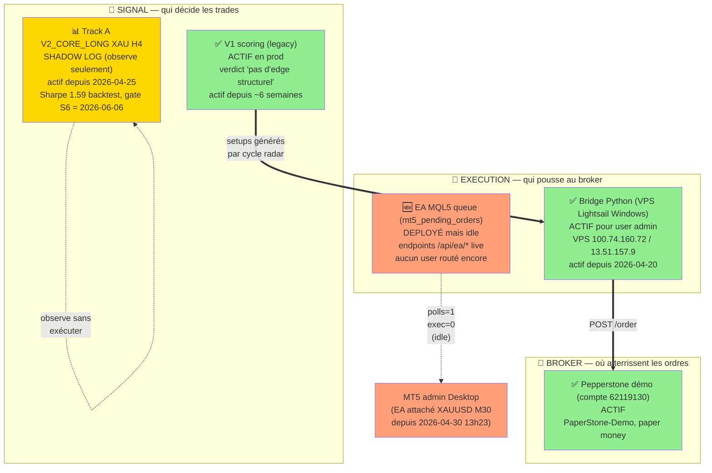

# Architecture — État actuel (source de vérité)

**Dernière mise à jour :** 2026-04-30
**Mainteneur :** mettre à jour à chaque transition (activation/désactivation d'une couche)

> Ce document décrit ce qui **tourne réellement en prod aujourd'hui**, pas ce qui
> existe dans le code. Si tu te demandes "on est sur quel système ?", la réponse
> est ici.

## TL;DR en une phrase

**Aujourd'hui, les trades qui se déclenchent en démo Pepperstone sont produits par
le système V1 (legacy scoring), exécutés via le bridge Python sur VPS Lightsail.**
L'EA MQL5 et Track A V2_CORE_LONG existent en parallèle mais ne tradent pas encore.

## Carte des 3 couches



**Légende :**
- 🟢 vert = actif, produit du trade en démo
- 🟡 jaune = actif, produit de la donnée mais pas de trade (observation)
- 🟠 orange = déployé mais idle (pas de routing vers cette couche)

## Détail couche par couche

### Couche 1 — Signal (qui décide les trades)

| Système | Statut | Depuis | Direction trades | Edge backtest |
|---|---|---|---|---|
| **V1 scoring legacy** | ✅ actif prod | ~6 semaines | Multi-pattern, multi-direction, multi-asset | ❌ pas d'edge structurel (verdict 2026-04-25) |
| **Track A V2_CORE_LONG XAU H4** | 📊 shadow log | 2026-04-25 | LONG only sur XAU + extensions XAG/WTI/ETH | ✅ Sharpe 1.59, maxDD 20% (24m backtest) |
| ML modèle | ❌ jamais activé | — | — | AUC 0.526 (pas d'edge ML) |

**Ce qui se passe concrètement** : à chaque cycle radar (toutes les ~2 min), V1 calcule
les setups, les insère en DB. Si `MT5_BRIDGE_ENABLED=true` et le setup match les filtres
(asset class, confidence ≥ seuil), il est pushé au bridge.

### Couche 2 — Execution (qui pousse les ordres au broker)

| Système | Statut | Depuis | Users routés |
|---|---|---|---|
| **Bridge Python (VPS Lightsail)** | ✅ actif | 2026-04-20 | admin (toi) |
| **EA MQL5 queue** | 🟠 déployé idle | 2026-04-29 deploy + 2026-04-30 attach | aucun (smoke seulement) |

**Pourquoi 2 chemins coexistent** : on est en transition bridge → EA. Le bridge marche,
on le garde tant que l'EA n'a pas été validé en réel. Une fois Cédric onboardé via EA
et stabilisé 3-4 jours, on pourra basculer admin sur EA aussi (et déprécier le bridge).

**Routage actuel** :
- `users.tier = 'premium'` AND `users.api_key_set = true` → EA queue (futur Cédric)
- Sinon → bridge Python (admin actuellement)

### Couche 3 — Broker (où atterrissent les ordres)

| Broker | Statut | Compte | Mode |
|---|---|---|---|
| **Pepperstone UK Demo** | ✅ actif | 62119130 / PepperstoneUK-Demo | Paper money |
| Pepperstone Réel | ❌ pas activé | — | Bloqué jusqu'à V2 macro ou Track A live |

**Mode démo intentionnel** : V1 a été validé sans edge → on n'investit pas en réel.
Le passage à argent réel est explicitement gaté sur l'activation Track A (gate S6
= 2026-06-06) ou un pivot V2 macro.

## Ce qui change dans les 6 prochaines semaines (planning)

| Date | Événement | Impact archi |
|---|---|---|
| 2026-04-30 (auj.) | Smoke EA admin sur XAUUSD M30 | EA attaché, idle |
| 2026-04-30 (auj.) | Mail Cédric envoyé | — |
| ~2026-05-02 | Cédric onboardé sur EA | EA queue passe ACTIVE pour Cédric |
| 2026-05-03 | Routine W1 shadow log | Premier rapport hebdo Track A |
| ~2026-05-10 | Décision admin → EA (si Cédric stable) | Bridge Python deprecated |
| 2026-06-06 | **Gate S6** Track A | GO Phase 5 (auto-exec démo Track A) ou continuation observation |
| 2026-06+ | Si gate S6 passé | Track A devient signal principal en démo, V1 désactivé |

## Comment vérifier ce qui tourne en live (commandes)

```bash
# 1. Quel système signal pousse les trades ?
curl -u admin:PASS https://app.scalping-radar.online/api/trades?limit=5
# → champ `signal_pattern` = source V1 (range_bounce_down, momentum_up, etc.)

# 2. Quelle couche execution est routée ?
# → champ `notes` du trade contient "Auto-exec via bridge MT5" = Bridge Python
# → si "Auto-exec via EA queue" = EA MQL5

# 3. État du shadow log Track A
curl https://app.scalping-radar.online/api/shadow/v2_core_long/public-summary?token=shdw_diaY5ZBXM1b4CjdwzN8kd572-ylWcbIg

# 4. État santé EA admin (sur PC local MT5)
# Onglet Experts dans MT5 → ligne "[ScalpingRadarEA] alive — polls=N exec=N fail=N"
```

## Pourquoi cet empilement (rationale)

On a **trois ères qui coexistent** parce qu'on est dans une transition :

1. **Ère V1 (legacy, ~mars 2026 → aujourd'hui)** : système initial, signaux multi-pattern.
   Backtest a invalidé son edge le 2026-04-25 mais on continue à le faire tourner en
   démo car (a) il alimente les analytics, (b) il sert de baseline observable, (c)
   l'arrêter avant Track A live = trou dans la timeline.

2. **Ère recherche Track A (2026-04-25 → maintenant)** : pivot vers un système
   risk-adjusted validé. En shadow log seulement jusqu'à gate S6.

3. **Ère pivot infra MQL5 (2026-04-29 → maintenant)** : changement d'architecture
   d'exécution (bridge Python → EA). Indépendant du signal, c'est juste pour
   simplifier l'onboarding des futurs users premium (Cédric en premier).

L'archi finale visée (~2026-06-15+) : **Track A signal → EA queue → Pepperstone démo**.
Trois couches simplifiées, V1 et bridge Python tous deux deprecated.

## Liens utiles

- Verdict V1 : [`docs/superpowers/specs/2026-04-22-backtest-v1-findings.md`](superpowers/specs/2026-04-22-backtest-v1-findings.md)
- Synthèse recherche : [`docs/superpowers/specs/2026-04-26-research-project-synthesis.md`](superpowers/specs/2026-04-26-research-project-synthesis.md)
- Spec EA pivot : [`docs/superpowers/specs/2026-04-29-mql5-ea-pivot-spec.md`](superpowers/specs/2026-04-29-mql5-ea-pivot-spec.md)
- Multi-tenant routing : [`docs/superpowers/specs/2026-04-28-multi-tenant-bridge-routing.md`](superpowers/specs/2026-04-28-multi-tenant-bridge-routing.md)
- Journal observation drawdown : [`docs/superpowers/journal/2026-04-30-v1-drawdown-observation.md`](superpowers/journal/2026-04-30-v1-drawdown-observation.md)
